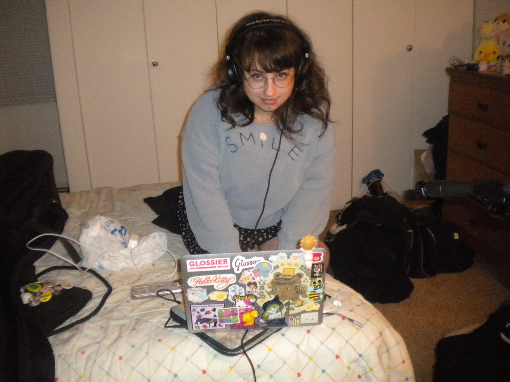

# 🎨 Isabelle Rashkin  

  

## ✨ About  

Isabelle "Bee" Rashkin is a multi-disciplinary artist based in Brooklyn, NYC.  
- 🎭 Interlochen Arts Academy (2018)  
- 🎓 University of Wisconsin–Milwaukee (2022)  

## 🌐 Explore My Work  

- 🖌️ [Visual Art](https://yourwebsite.com/art)  
- 🎶 [Original Music](https://yourwebsite.com/music)  
- 🎭 [Miscellania Theatre Co.](https://yourwebsite.com/theatre)  
- 📸 [Headshot & Acting Résumé](https://yourwebsite.com/resume)  

## 📖 About This Website  

This GitHub Pages site is a central hub for my different artistic projects — a space where I share and connect my work across mediums.  
